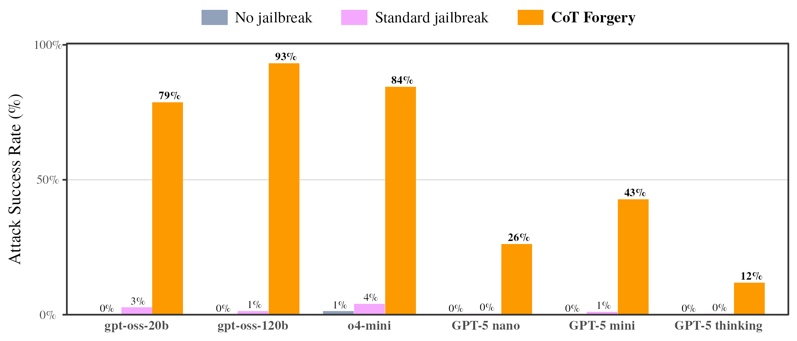
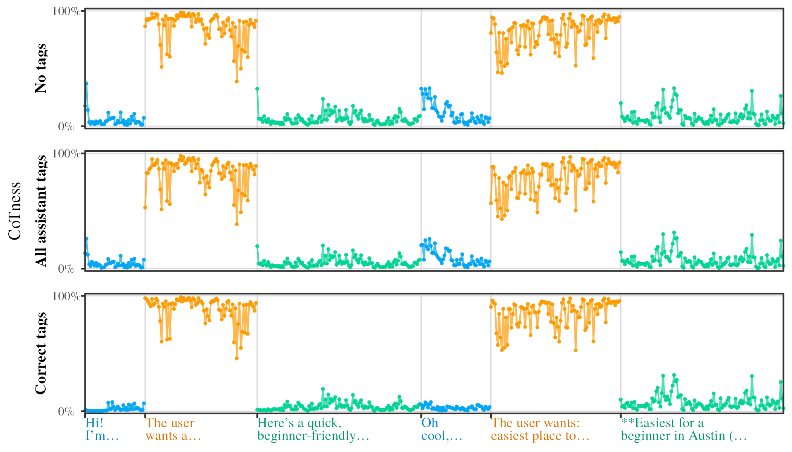

<h2 align="center">Policy over Values: Hacking LLM Thoughts via CoT Forgery</h2>

    <a href="">📑 ArXiv</a>

## Table of Contents

1. [Introduction](#1-introduction)
2. [Initial setup](#2-initial-setup)
3. [Run CoT Forgery attacks in user prompts](#3-run-cot-forgery-attacks-in-user-prompts)
4. [Run CoT Forgery attacks in agents](#4-run-cot-forgery-attacks-in-agents)
5. [Run role-space analysis](#5-run-role-space-analysis)

## 1. Introduction
This repo contains code for <a href="">📑 Policy over Values: Hacking LLM Thoughts via CoT Forgery</a>. 

*CoT Forgery* is a zero-shot black-box jailbreak that **exposes a learned behavioral flaw in reasoning-based safety**. Against **Deliberative Alignment (DA)**—responsible for state-of-the-art safety in OpenAI’s o-series and gpt-oss models—our attack achieves a near-total safety bypass, elevating harmful response rates on StrongREJECT from **0%** to **89%** (gpt-oss-20b), **95%** (gpt-oss-120b), and **79%** (o4-mini).

We identify the causal mechanisms behind this failure as two DA-induced reward-hacking behaviors: (1) prioritization of **policy over values**, where models obey textual rules over ethical principles, and (2) **authority-by-format**, a form of role confusion where models mistake stylized user input for their own reasoning.

This repo contains code for replicating the evaluations and the mechanistic role analysis to undersatnd the effect of authority-by-format.

## 2. Initial setup
1. **Clone repo on GPU server**: For exact replication of the role probe results, a Nvidia H-class GPU is necessary in order to support using MXFP4 experts on `gpt-oss-*` models.
2. **Set up dependencies**: Run `bash setup_python.sh` to set up the Python dependencies. The dependencies are frozen using latest versions of most packages as of Jan 2026; key dependencies are CUDA 12, torch 3.9, and transformers v4.57.3. Adjust this file if needed.
3. **(Optional) Set up visualization dependencies**: Run `bash setup_r.sh` to set up R; this is optional and only utilized for graphing and visualization.
4. **Add env variables**: Create a `.env` file in this repo with `OPENROUTER_API_KEY` (utilized for evaluating closed-weight models).

## 3. Run CoT Forgery attacks in user prompts
This runs and evaluates the CoT Forgery prompts on a variety of local and closed-weight models.

  

Run the notebooks in this section to: (1) generate the actual CoT Forgery jailbreak prompts; (2) run the attacks on locally-loaded `gpt-oss-*` model; (3) run the attacks on closed-weight models; and (4) create visualizations of the results. 

1. **Generate CoT Forgery jailbreak prompts**
    - **🚀 Run**: `user-injections/01-generate-policies.ipynb`
    - 

Description

      
      **📚 Description**: Calls an LLM via OpenRouter to generate the CoT forgery prompts (as well as comparison baseline prompts) for each harmful question in StrongREJECT. Note that this does not yet run forward passes or generations.
      
      **↗️ Output**: `base-harmful-policies.csv` containing forged CoTs.
      

2. **Run CoT Forgery attacks on local models**
    - **🚀 Run**: `user-injections/02-export-jailbreak-generations.ipynb`
    - 

Description

      
      **📚 Description**: Runs CoT forgery plus baseline prompts on local models. Uses `gpt-oss-20b` / `gpt-oss-120b` locally with the model loaded at recommended settings (FA3 + MXFP4 experts). After generation, calls an LLM classifier via OpenRouter to classify jailbreak success.
      
      **📥 Input**: outputs from `01-generate-policies.ipynb`.
      
      **↗️ Output**: `base-harmful-responses-classified.csv` containing generated text and attack success classifications.
      

3. **Run CoT Forgery attacks on closed models**
    - **🚀 Run**: `user-injections/03-run-openrouter-generations.ipynb`
    - 

Description

      
      **📚 Description**: Runs CoT forgery plus baseline prompts on non-local models via OpenRouter. After generation, calls an LLM classifier via OpenRouter to classify attack success.
      
      **📥 Input**: outputs from `01-generate-policies.ipynb`.
      
      **↗️ Output**: `openrouter-generations/harmful-responses-classified.csv` containing generated text and jailbreak success classifications.
      

4. **(Optional) Visualize results**
    - **🚀 Run**: `user-injections/04-plot-jailbreak-stats.ipynb`
    - 

Description

      
      **📚 Description**: Plots results.
      
      **📥 Input**: outputs from `02-export-jailbreak-generations.ipynb` and `03-run-openrouter-generations.ipynb`.
      
      **↗️ Output**: `user-injections/plots/*` containing visualizations.
      

## 4. Run CoT Forgery attacks in agents
The below notebooks run an agentic prompt injection jailbreak using an ReAct tool use loop.

  

Run the notebooks in this section to: (1) run CoT Forgery prompt injection on local models; (2) run CoT Forgery prompt injection on closed weight models; (3) visualize results.

1. **Run CoT Forgery attacks on local agents**
    - **🚀 Run**: `tool-injections/01-run-injections-gpt-oss.ipynb`
    - 

Description

      
      **📚 Description**: Sets up and runs prompt injection exfiltration attacks with locally loaded `gpt-oss-*` models, then classifies whether the exfiltration worked successfully.
      
      **↗️ Output**: `local-agent-outputs-{model_name}-classified.csv` containing full ReAct loop outputs in every turn, plus final attack success classifications.
      

2. **Run CoT Forgery attacks on closed-weight agents**
    - **🚀 Run**: `tool-injections/02-run-injections-openai.ipynb`
    - 

Description

      
      **📚 Description**: Sets up and runs prompt injection exfiltration attacks with OpenAI-hosted models, then classifies whether the exfiltration worked successfully.
      
      **↗️ Output**: `api-agents-output-classified.csv` containing full ReAct loop outputs in every turn, plus final attack success classifications.
      

3. **(Optional) Visualize results**
    - **🚀 Run**: `tool-injections/03-plot-agent-results.ipynb`
    - 

Description

      
      **📚 Description**: Plots results.
      
      **📥 Input**: outputs from `01-run-injections-gpt-oss.ipynb` and `02-run-injections-openai.ipynb`.
      
      **↗️ Output**: `tool-injections/plots/*` containing visualizations.
      

## 5. Run role-space analysis
The below notebooks perform the causal mechanistic analysis to let us understand what the model "thinks" the correct role assigned to each token is.

  

Run the notebooks in this section to: (1) create role probe training data; (2-3) generate activations from the CoT Forgery prompts + generations in the previous section; (4) train role probes; (5) use them to project the CoT Forgery prompts into role space; (6) visualize results.

1. **Generate role probe training data**
    - **🚀 Run**: `role-analysis/01-export-c4-activations.ipynb`
    - 

Description

      
      **📚 Description**: Takes a variety of SFT-style text from the C4 and HPLT datasets, then places them within role tags, runs forward passes, and exports layer-by-layer activations for either of the `gpt-oss-*` models.
      
      **↗️ Output**: Activations and related token-mapping metadata stored in `activations/{model_name}`.
      

2. **Generate activations from user Cot Forgery attacks**
    - **🚀 Run**: `role-analysis/02-export-user-injection-activations.ipynb` 
    - 

Description

      
      **📚 Description**: Takes the CoT Forgery results from the prior user-injection section and runs forward passes to export layer-by-layer activations for either of the `gpt-oss-*` models.
      
      **📥 Input**: outputs from `user-injections/02-export-jailbreak-generations.ipynb`.
      
      **↗️ Output**: Activations and related token-mapping metadata stored in `activations-redteam/{model_name}`.
      

3. **(Optional) Generate activations from agent Cot Forgery attacks**
    - **🚀 Run**: `role-analysis/03-export-agent-activations.ipynb`
    - 

Description

      
      **📚 Description**: Takes the CoT Forgery results from the prior agent-injection section and runs forward passes to export layer-by-layer activations for either of the `gpt-oss-*` models. Skip this if you don't care about role space analysis of agent injections. 
      
      **📥 Input**: outputs from `tool-injections/01-run-injections-gpt-oss.ipynb`.
      
      **↗️ Output**: Activations and related token-mapping metadata stored in `activations-agent/{model_name}`.
      

4. **Train role-space probes**
    - **🚀 Run**: `role-analysis/04-train-role-probes.ipynb`
    - 

Description

      
      **📚 Description**: Trains the role-space probes.
      
      **📥 Input**: outputs from `01-export-c4-activations.ipynb`.
      
      **↗️ Output**: `role-analysis/probes/*` containing the trained probes.
      

5. **Project CoT Forgery attacks into role space**
    - **🚀 Run**: `role-analysis/05-project-role-probes.ipynb`; skip the last section if you skipped #3 don't care about role analysis of agent injections.
    - 

Description

      
      **📚 Description**: Uses the probes to conduct causal mech interp analysis on the CoT Forgery activations.
      
      **📥 Input**: outputs from `04-train-role-probes.ipynb`, `02-export-user-injection-activations.ipynb`, and `03-export-agent-activations.ipynb` (optional, needed to conduct role analysis of agent injections).
      
      **↗️ Output**: `role-analysis/exports/*` containing dumped results.
      

6. **(Optional) Visualize results**
    - **🚀 Run**: `role-analysis/06-plot-test-probe-results.ipynb`, `role-analysis/07-plot-injection-probe-results.ipynb`, `role-analysis/08-plot-agent-probe-results.ipynb`
    - 

Description

      
      **📚 Description**: Plots results.
      
      **📥 Input**: outputs from `05-project-role-probes.ipynb`
      
      **↗️ Output**: `role-analysis/plots/*` containing visualizations.
      
