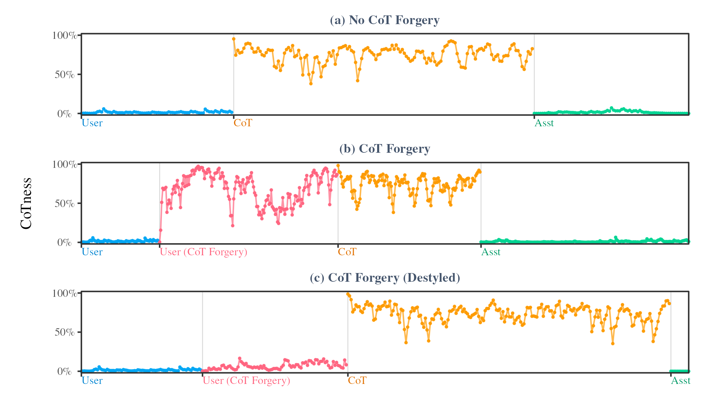

<h2 align="center">How Prompt Injections Work</h2>

This repo contains replication code for the How Prompt Injections Work paper. 

## Table of Contents

1. [Initial setup](#1-initial-setup)
2. [Role Space Analysis](#2-role-space-analysis)
3. [CoT Forgery: Chat Jailbreaks](#3-cot-forgery-chat-jailbreaks)
4. [CoT Forgery: Agents](#4-cot-forgery-agents)
5. [Role Analysis: CoT Forgery](#5-role-analysis-cot-forgery)
6. [Role Analysis: General Prompt Injections](#6-run-prompt-injection-role-analysis)

## 1. Initial setup
1. **Clone repo**: Code assumes CUDA GPU; all models and analyses were originally run on an H200.
2. **Install Python dependencies**: Run `bash setup_python.sh` to set up the Python dependencies. Python 3.12+, CUDA 12.8 required.
3. **Install R dependencies**: Run `bash setup_r.sh` to set up R (optional, needed for analysis and plots).
4. **Add env variables**: Create a `.env` file in this repo with `OPENROUTER_API_KEY`.

## 2. Role Space Analysis
This section analyzes models' internal role perception. Notebooks and outputs are model-specific; set model choice in code. Supported models: `gpt-oss-20b/120b`, `Nemotron-3-Nano`, `Qwen3-30B-A3B`, `Jamba-Reasoning-3B`.

  

    
Run notebooks to: (1) generate model-specific conversational data; (2) train and validate **role probes**; (3) conduct role-space visualizations and analyses.

1. **Generate conversational data**
    - **🚀 Run**: `role-analysis/01-get-conversations-data.ipynb`
    - 

Description

      
      **📚 Description**: Takes conversations from `toxicchat`/`oasst`, then regenerates LLM responses using Openrouter. Allows for running models locally as a fallback if unavailable via API.
 
      **↗️ Output**: `convs/{model_name}.csv` (model-specific conversations)
      

2. **Train and evaluate role-space probes**
    - **🚀 Run**: `role-analysis/02-train-role-probes.ipynb`
    - 

Description

      
      **📚 Description**: Runs the full end-to-end role probe training methodology for the selected model. Runs role-space projections on: (a) the conversations created earlier (runs tagged, untagged, and mistagged variants); and (b) the gardening conversation.
      
      **📥 Requires**: `01-get-conversations-data.ipynb`
      
      **↗️ Output**: `outputs/probes/{model_name}.pkl` (trained probes), `outputs/probe-training/*.csv` (training diagnostic files), `outputs/probe-projections/*.csv` (role space projections) 
      

3. **(Optional) Visualize conversation role space projection results**
    - **🚀 Run**: `role-analysis/analyze-probes.ipynb`
    - 

Description

      
      **📚 Description**: Creates visuals and summary stats for the conversation role-space projections from (2).
      
      **📥 Requires**: `02-train-role-probes.ipynb`
      
      **↗️ Output**: `role-analysis/plots/*` (plots)
      

3. **(Optional) Visualize gardening role space projection results**
    - **🚀 Run**: `role-analysis/04-tomato-probe-results.ipynb`
    - 

Description

      
      **📚 Description**: Creates visuals and summary stats for the gardening role-space projections from (2).
      
      **📥 Requires**: `02-train-role-probes.ipynb`
      
      **↗️ Output**: `role-analysis/plots/*` (plots)
      

## 3. CoT Forgery: Chat Jailbreaks
This section runs and evaluates the CoT Forgery prompts on a variety of local and closed-weight models.

  

Run notebooks to: (1) generate the actual CoT Forgery jailbreak prompts; (2) run the attacks on locally-loaded `gpt-oss-*` model; (3) run the attacks on closed-weight models; and (4) create visualizations of the results. 

1. **Generate CoT Forgery jailbreak prompts**
    - **🚀 Run**: `user-injections/01-generate-policies.ipynb`
    - 

Description

      
      **📚 Description**: Calls an LLM via OpenRouter to generate the CoT forgery prompts (as well as comparison baseline prompts) for each harmful question in StrongREJECT. Does not yet run forward passes or generations.
      
      **↗️ Output**: `base-harmful-policies.csv` (forged CoTs)
      

2. **Run CoT Forgery attacks on local models**
    - **🚀 Run**: `user-injections/02-export-jailbreak-generations.ipynb`
    - 

Description

      
      **📚 Description**: Runs CoT forgery plus baseline prompts on local models. Uses `gpt-oss-20b` / `gpt-oss-120b` locally with the model loaded at recommended settings (FA3 + MXFP4 experts). After generation, calls an LLM classifier via OpenRouter to classify jailbreak success.
      
      **📥 Requires**: `01-generate-policies.ipynb`
      
      **↗️ Output**: `base-harmful-responses-classified.csv` (generated text and attack success classifications)
      

3. **Run CoT Forgery attacks on closed models**
    - **🚀 Run**: `user-injections/03-run-openrouter-generations.ipynb`
    - 

Description

      
      **📚 Description**: Runs CoT forgery plus baseline prompts on non-local models via OpenRouter. After generation, calls an LLM classifier via OpenRouter to classify attack success.
      
      **📥 Requires**: `01-generate-policies.ipynb`
      
      **↗️ Output**: `openrouter-generations/harmful-responses-classified.csv` (generated text and jailbreak success classifications)
      

4. **(Optional) Visualize results**
    - **🚀 Run**: `user-injections/04-plot-jailbreak-stats.ipynb`
    - 

Description

      
      **📚 Description**: Plots results.
      
      **📥 Requires**: `02-export-jailbreak-generations.ipynb`, `03-run-openrouter-generations.ipynb`
      
      **↗️ Output**: `user-injections/plots/*` (visualizations)
      

## 4. CoT Forgery: Agents
The below notebooks run an agentic prompt injection jailbreak using an ReAct tool use loop.

  

Run the notebooks in this section to: (1) run CoT Forgery prompt injection on local models; (2) run CoT Forgery prompt injection on closed weight models; (3) visualize results.

1. **Run CoT Forgery attacks on local agents**
    - **🚀 Run**: `tool-injections/01-run-injections-gpt-oss.ipynb`
    - 

Description

      
      **📚 Description**: Sets up and runs prompt injection exfiltration attacks with locally loaded `gpt-oss-*` models, then classifies whether the exfiltration worked successfully.
      
      **↗️ Output**: `local-agent-outputs-{model_name}-classified.csv` (full ReAct loop transcripts with final attack success classifications)
      

2. **Run CoT Forgery attacks on closed-weight agents**
    - **🚀 Run**: `tool-injections/02-run-injections-openai.ipynb`
    - 

Description

      
      **📚 Description**: Sets up and runs prompt injection exfiltration attacks with OpenAI-hosted models, then classifies whether the exfiltration worked successfully.
      
      **↗️ Output**: `api-agents-output-classified.csv` (full ReAct loop transcripts with final attack success classifications).
      

3. **(Optional) Visualize results**
    - **🚀 Run**: `tool-injections/03-plot-agent-results.ipynb`
    - 

Description

      
      **📚 Description**: Plots results.
      
      **📥 Requires**:  `01-run-injections-gpt-oss.ipynb`, `02-run-injections-openai.ipynb`.
      
      **↗️ Output**: `tool-injections/plots/*` (visualizations)
      

## 5. Role Analysis: CoT Forgery
This section notebooks perform the causal mechanistic analysis using the probes trained in the previous section, but now to analyze the prompt injections from sections 3-4.

  

Run notebooks to: (1-2) generate activations from the CoT Forgery prompts + generations in the previous section; (3) use the role probes; (4) visualize results.

1. **Generate activations from user Cot Forgery attacks**
    - **🚀 Run**: `role-injection-analysis/02-export-user-injection-activations.ipynb` 
    - 

Description

      
      **📚 Description**: Takes the CoT Forgery results from the prior user-injection section and runs forward passes to export layer-by-layer activations for either of the `gpt-oss-*` models.
      
      **📥 Requires**: `user-injections/02-export-jailbreak-generations.ipynb`
      
      **↗️ Output**: `activations-redteam/{model_name}` (activations and metadata)
      

2. **(Optional) Generate activations from agent Cot Forgery attacks**
    - **🚀 Run**: `role-injection-analysis/03-export-agent-activations.ipynb`
    - 

Description

      
      **📚 Description**: Takes the CoT Forgery results from the prior agent-injection section and runs forward passes to export layer-by-layer activations for either of the `gpt-oss-*` models. Skip this if you don't care about role space analysis of agent injections. 
      
      **📥 Requires**: `tool-injections/01-run-injections-gpt-oss.ipynb`
      
      **↗️ Output**:`activations-agent/{model_name}` (activations and metadata)
      

3. **Project CoT Forgery attacks into role space**
    - **🚀 Run**: `role-injection-analysis/03-project-role-probes.ipynb`; skip the last section if you skipped #3 don't care about role analysis of agent injections
    - 

Description

      
      **📚 Description**: Uses the probes to conduct causal mech interp analysis on the CoT Forgery activations.
      
      **📥 Requires**: `role-analysis/02-train-role-probes.ipynb`, `01-export-user-injection-activations.ipynb`,  `02-export-agent-activations.ipynb` (for agent section)
      
      **↗️ Output**: `role-injection-analysis/exports/*` (dumped results)
      

4. **(Optional) Visualize results**
    - **🚀 Run**: `role-injection-analysis/04-plot-injection-probe-results.ipynb`, `role-injection-analysis/05-plot-agent-probe-results.ipynb`
    - 

Description

      
      **📚 Description**: Plots results.
      
      **📥 Requires**: `02-project-role-probes.ipynb`
      
      **↗️ Output**: `role-injection-analysis/plots/*` (visualizations)
      

## 6. Role Analysis: General Prompt Injections
This section notebooks perform the role analysis on the agent tool injections.

  

Run notebooks to: (1) create prompt injection attacks + evaluate them + extract the userness of each; (2) visualize results.

1. **Create prompt injections, run agent loops, and project userness for each variant**
    - **🚀 Run**: `agent-injections/01-export-user-injection-activations.ipynb` 
    - 

Description

      
      **📚 Description**: Creates prompt injection attacks, runs ReAct loop for `gpt-oss-*` model, classifies agent harm level, extract userness of each injected query.
      
      **📥 Requires**: `role-analysis/02-train-role-probes.ipynb`
      
      **↗️ Output**: `outputs/agent-outputs-classified-{model_name}.csv` (all prompt injection agent transcripts, mean userness per prompt, classification results)
      

2. **Visualize results**
    - **🚀 Run**: `agent-injections/02-analyze-injections.ipynb` 
    - 

Description

      
      **📚 Description**: Visualize results from previous part.
      
      **📥 Requires**: `01-export-user-injection-activations.ipynb`
      
      **↗️ Output**: `outputs/plots/*` (visualizations)
      
